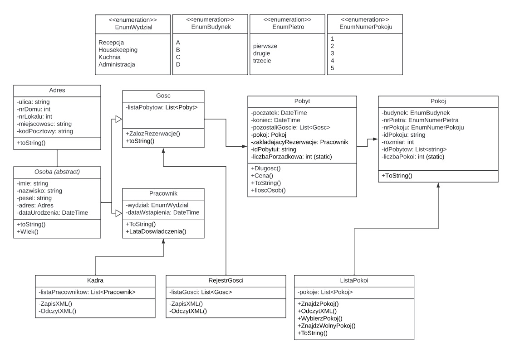

# Projekt - System Obsługi Hotelu
### Podział zadań

### Diagram UML
([link do edycji])(https://lucid.app/lucidchart/aff13f31-4b23-4d71-bead-9306d98ce140/edit?viewport_loc=-140%2C-481%2C3111%2C1460%2CHWEp-vi-RSFO&invitationId=inv_88ea429b-d3f0-4630-8f70-d7bfa86d66b6)

### Mechanizm zakładania rezerwacji
W oknie 'Dodaj rezewację' należy wybrać gościa dla którego zakładamy rezerwację, datę początku i końca oraz pracownika zakładającego rezerwację. Wybranie pokoju jest opcjonalne - jeśli tego nie zrobimy, rezerwacja zostanie założona w pierwszym pokoju spełniającym podane wymagania (rozmiar pokoju oraz czy jest wolny w podanym przedziale czasowym). Jeżeli zdecydujemy się na ręczny wybór, program poinformuje nas o ewentualnej niezgodności rozmiaru lub konflikcie pobytów w podanym czasie.

### 
 
